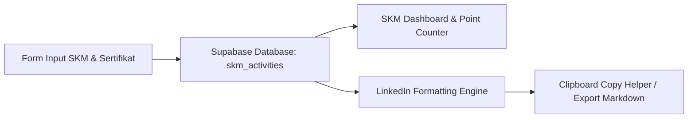

# 🏅 Modul 1: Satuan Kegiatan Mahasiswa (SKM) & LinkedIn Assistant - Overview

Modul SKM dirancang khusus untuk memfasilitasi pencatatan seluruh track record kegiatan akademik, non-akademik, organisasi, kepanitiaan, kompetisi, dan sertifikasi mahasiswa selama masa studi. 

Tujuan utama dari modul ini adalah **menghilangkan kerumitan penyusunan portofolio saat dibutuhkan untuk pengisian profil LinkedIn, CV, atau pengajuan SKM kampus.**

---

## 🎯 Tujuan & Value Proposition

- **Centralized Repository**: Menyimpan bukti sertifikat, deskripsi peran, dan daftar pencapaian dalam satu database terstruktur.
- **Automated Poin SKM Counter**: Mengakumulasi poin kredit SKM sesuai bobot aturan perguruan tinggi.
- **LinkedIn / Resume Instant Generator**: Mengonversi riwayat kegiatan menjadi teks deskripsi profesional yang siap dipaste langsung ke bagian *Experience*, *Licenses & Certifications*, atau *Honors & Awards* di LinkedIn.

---

## 🧩 Arsitektur Komponen Modul SKM



---

## 🗃️ Skema Tabel Supabase (`skm_activities`)

```sql
CREATE TABLE skm_activities (
    id UUID DEFAULT gen_random_uuid() PRIMARY KEY,
    user_id UUID REFERENCES profiles(id) ON DELETE CASCADE,
    judul VARCHAR(255) NOT NULL,
    kategori VARCHAR(100) NOT NULL, -- Prestasi/Lomba, Organisasi, Sertifikasi, Kepanitiaan, Workshop/Pelatihan
    penyelenggara VARCHAR(255) NOT NULL,
    tanggal_mulai DATE NOT NULL,
    tanggal_selesai DATE,
    poin_skm INT DEFAULT 0,
    deskripsi TEXT,
    skill_tags TEXT[], -- ['React', 'Data Science', 'Leadership']
    certificate_url TEXT,
    created_at TIMESTAMP WITH TIME ZONE DEFAULT TIMEZONE('utc', NOW())
);
```
