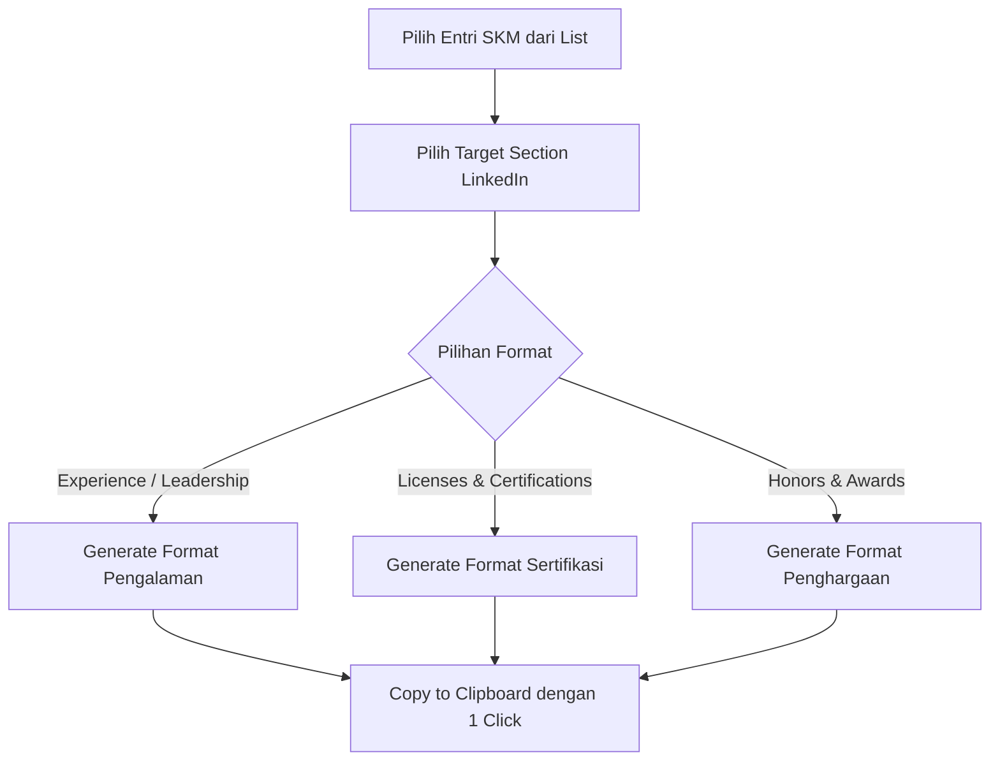

# 🔗 Modul SKM - Fitur LinkedIn & Resume Formatting Assistant

Dokumen ini menjabarkan spesifikasi generator format teks otomatis untuk pengisian profil LinkedIn dan penyusunan Curriculum Vitae (CV).

---

## ⚡ Alur Kerja & Mekanisme Generator Teks



---

## 📝 Format Output Teks Siap-Paste per Bagian LinkedIn

### 1. Format Target: LinkedIn Experience (Pengalaman Organisasi / Kepanitiaan)
```text
Title: Ketua Divisi Web Development
Company: Himpunan Mahasiswa Teknik Informatika (HMTI)
Dates: Jan 2025 - Des 2025
Description:
• Memimpin tim berisi 5 developer dalam merancang dan mengembangkan portal web HIMA.
• Mengimplementasikan tech stack React & Supabase untuk efisiensi penyimpanan data.
• Berhasil meningkatkan partisipasi anggota sebesar 40% melalui platform baru.

Skills: React.js · Supabase · Team Leadership · Web Development
```

### 2. Format Target: LinkedIn Licenses & Certifications (Sertifikasi)
```text
Name: Certified Professional Web Developer
Issuing Organization: Dicoding Indonesia
Issue Date: Agustus 2026
Credential ID: SKM-CERT-2026-0881
Credential URL: https://your-supabase-url.storage/skm-certificates/cert-01.pdf

Skills: React.js · Next.js · PostgreSQL
```

### 3. Format Target: LinkedIn Honors & Awards (Prestasi & Kejuaraan)
```text
Title: Juara 1 Hackathon Innovation Challenge 2026
Associated with: Sekolah Tinggi Teknologi Bontang
Issuer: Kementerian Komunikasi dan Informatika RI
Issue Date: Juli 2026
Description:
Mengembangkan solusi web IoT berbasis smart monitoring untuk efisiensi energi industri.
```

---

## 💡 Fitur Unggulan UI:
- **1-Click Copy Button**: Menggunakan Browser Clipboard API untuk menyalin format teks langsung.
- **Markdown Export**: Menyalin seluruh ringkasan portofolio dalam format Markdown siap pakai untuk README GitHub personal.
